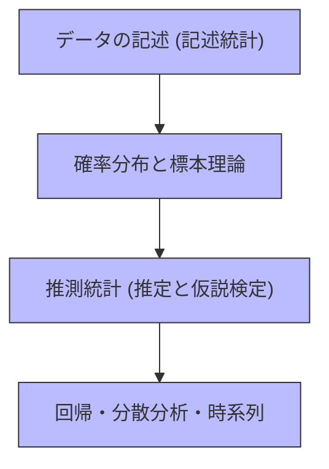
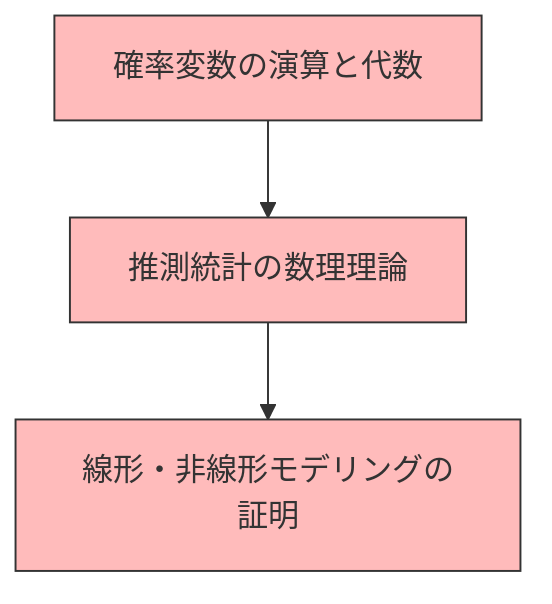

# 統計検定 各級の出題範囲・学習ガイド総合版（2級・準1級・1級）

本資料は、統計検定2級、準1級、および1級（最高峰）の出題範囲、試験概要、求められる数学的深度、および主要トピックを体系的に整理したものです。

---

## 1. 各級の比較一覧

| 項目 | 統計検定2級 | 統計検定準1級 | 統計検定1級 |
| :--- | :--- | :--- | :--- |
| **位置づけ** | 大学基礎課程（1・2年次）の基礎 | 大学専門課程（3・4年次）の応用 | 大学専門課程〜大学院基礎の専門理論 |
| **試験方式** | CBT（コンピューター） | CBT（コンピューター） | 筆記（記述式・年1回） |
| **試験科目** | 統計学基礎 | 統計学実践 | ① 統計数理<br>② 統計応用（分野選択） |
| **試験時間** | 90分 | 90分 | 各90分（計180分） |
| **問題数** | 約35問（一問一答） | 約20〜30問（大問形式） | 5問中3問選択（記述式） |
| **合格基準** | 正答率 約60%以上 | 正答率 約60%〜70%以上 | 素点ベースで合格点以上 |
| **数学レベル** | 高校数学（I・A、II・B）程度 | 大学数学（微分積分、線形代数の基礎） | 大学数学（重積分、行列計算、線形空間） |
| **解答形式** | 選択式のみ | 選択式 ＆ 数値入力式 | **論述・証明・数式導出（完全記述）** |

---

## 2. 統計検定 2級（大学基礎レベル）

2級は、記述統計、確率の基礎、そして標本分布をベースにした**推定・検定・回帰分析の基本的な適用手順**を問う試験です。

### 2.1 2級の主要分野とトピック



#### I. データの記述・要約（記述統計）
- **データの整理**: 度数分布表、ヒストグラム、累積相対度数、幹葉図、箱ひげ図
- **代表値と散布度**: 平均値（算術・幾何・調和）、中央値、最頻値、分散、標準偏差、四分位数、変動係数（CV）
- **2変数の関係**: 散布図、共分散、相関係数（ピアソン）、順位相関係数（スピアマン）、偏相関係数

#### II. 確率と確率分布
- **確率の基礎**: 確率の加法定理、条件付き確率、乗法定理、**ベイズの定理**、事象の独立
- **主要な確率分布**: 二項分布 $B(n, p)$、ポアソン分布 $Po(\lambda)$、幾何分布、一様分布、指数分布、正規分布 $N(\mu, \sigma^2)$、標準正規分布 $N(0, 1)$

#### III. 標本分布と統計的推論
- **極限定理**: **中心極限定理**、大数の法則
- **標本分布**: $\chi^2$分布、t分布、F分布の性質と役割
- **統計的推定**: 点推定（不偏推定量、一致推定量）、区間推定（母平均、母比率、母分散、2標本の差）
- **仮説検定の基本**: 帰無仮説・対立仮説、p値、有意水準、第1種・第2種の過誤、検出力（$1-\beta$）
- **各種検定法**: 母平均の検定（1標本、等分散の2標本、対応のある2標本）、母比率の検定、等分散のF検定、**独立性の検定（$\chi^2$）**、**適合度の検定（$\chi^2$）**

#### IV. 線形モデルとその他のトピック
- **回帰分析**: 最小二乗法、回帰係数の有意性検定、**決定係数 $R^2$**、残差分析、重回帰の基本、自由度調整済み決定係数
- **分散分析**: 一元配置分散分析、F統計量の導出（分散分析表）
- **その他**: 実験計画法の基本（フィッシャーの3原則）、標本調査法（単純無作為、層化、集落）、時系列解析（移動平均、季節調整）、指数（ラスパイレス式・パーシェ式）

---

## 3. 統計検定 準1級（大学応用レベル）

準1級は、2級の全範囲に加え、**多変量解析、時系列解析、確率過程、ベイズ法、不完全データ処理、機械学習の基礎**など、現代のデータサイエンスで用いられる広範な応用手法をカバーします。

> [!NOTE]
> 準1級のシラバスは公式テキストである**『統計学実践ワークブック』全32章**に準拠しています。詳細については [statistics_pre1_syllabus.md](file:///C:/Users/kazuo-suyama/.gemini/antigravity/brain/508ce8ad-6179-43f9-b47f-4aa361e968a1/statistics_pre1_syllabus.md) をご参照ください。

### 3.1 準1級の主要追加トピック
1. **確率論の拡張**: 多変数の変数変換（ヤコビアン）、モーメント母関数、確率変数の和の分布、順序統計量
2. **統計理論の深化**: 十分統計量（因子分解定理）、有効性、フィッシャー情報量、クラメール・ラオの下限、最尤法、尤度比検定、ネイマン・ピアソンの基本定理、ノンパラメトリック検定（ウィルコクソン）
3. **回帰モデルの拡張**: 回帰診断法（ハット行列、クックの距離）、質的回帰（ロジスティック回帰）、一般化線形モデル（GLM）、正則化回帰（Ridge, Lasso）
4. **多変量解析の実践**: 主成分分析、判別分析（マハラノビス汎距離）、クラスター分析（ウォード法、k-means）、因子分析、グラフィカルモデル
5. **時系列・確率過程**: 定常時系列、AR/MA/ARMAモデル、自己相関、マルコフ連鎖、ポアソン過程
6. **データ処理とモデリング**: 欠損データの処理（EMアルゴリズム）、モデル選択基準（AIC, BIC）、ベイズ統計（MCMC）、シミュレーション（ブートストラップ法）

---

## 4. 統計検定 1級（大学専門・最高峰レベル）

1級は、「**統計数理**」と「**統計応用**」の2科目（ともに完全記述式）から構成され、統計学の**数理的な証明・導出能力**と、専門分野への**深い応用モデリング能力**を評価します。

### 4.1 統計数理（必須共通科目）
統計数理では、極めて高い数式変形能力と、積分・線形代数を用いた理論の証明が求められます。



#### I. 確率と確率分布
- **確率変数の特性**: 多次元確率変数、同時確率密度、周辺分布、条件付き分布、期待値ベクトルの行列表示、共分散行列
- **母関数と極限定理**: モーメント母関数・特性関数の一意性、確率収束・法則収束、中心極限定理の数理、デルタ法、スラスキーの定理
- **各種確率分布の数理**: ガンマ分布、ベータ分布、コーシー分布、多変量正規分布、十分統計量の数理、指数型分布族の性質

#### II. 統計的推測の理論
- **点推定理論**: 
  - **一様最小分散不偏推定量（UMVUE）**の導出
  - クラメール・ラオの不等式の証明とフィッシャー情報量行列
  - 十分性（ラオ・ブラックウェルの定理、完備十分統計量）
  - 最尤推定量の漸近不偏性、漸近有効性、漸近正規性
- **仮説検定理論**:
  - ネイマン・ピアソンの基本定理を用いた**一様最強力検定（UMPT）**の構成
  - **尤度比検定**、ワルド（Wald）検定、スコア（Score）検定の数理的関係
  - 漸近検定統計量の $\chi^2$ 近似の証明

#### III. 線形モデルと応用数理
- **線形モデル**: **ガウス・マルコフの定理**の証明、射影行列（ハット行列）の代数的性質、回帰係数の平方和の直交分解
- **分散分析と実験計画**: 二元配置以上の分散分析における分散成分の推論、直交配列の数学的性質

---

### 4.2 統計応用（専門選択科目）
統計応用は、出願時に選択した専門分野（以下の4つから1分野）についての具体的なモデリング、計算、解釈を行います。

```carousel
#### 人文科学
- **テスト理論**: 項目反応理論（IRT）、古典的テスト理論、信頼性・妥当性
- **因子分析**: 共分散構造分析（SEM）、マルチレベル線形モデル（階層線形モデル）
- **カテゴリデータ**: 多次元分割表、対数線形モデル、対応分析
- **その他**: 多次元尺度構成法（MDS）、クラスター分析の応用

<!-- slide -->

#### 社会科学
- **計量経済学**: 構造方程式モデル、操作変数法、パネルデータ分析、同時決定バイアス
- **時系列解析の応用**: 単位根検定（ADF検定）、共積分（コインテグレーション）、VARモデル、状態空間モデル、カルマンフィルタ
- **経済統計**: 国民経済計算（SNA）、景気動向指数、人口統計（生命表、合計特殊出生率）
- **社会調査**: 複雑な標本調査のデザイン、回答バイアスの補正

<!-- slide -->

#### 理工学
- **品質管理 (SQC)**: 管理図（Xbar-R, EWMA）、抜取検査、品質工学（タグチメソッド、S/N比）
- **信頼性工学**: 故障寿命分布（ワイブル、対数正規）、ハザード関数、信頼性ブロック図、コックス比例ハザードモデル
- **実験計画の深化**: 応答曲面法、配合設計、直交表の割り付け
- **応用物理・システム**: カルマンフィルタ、信頼性設計、モンテカルロフィルタ

<!-- slide -->

#### 医薬生物学
- **生存時間解析**: カプラン・マイヤー生存曲線、ログランク検定、コックスの比例ハザードモデル
- **臨床試験の計画**: ランダム化、二重盲検、クロスオーバー計画、非劣性試験・優越性試験、必要なサンプルサイズ計算（検出力計算）
- **疫学**: 相対リスク（RR）、オッズ比（OR）、感度・特異度、ROC曲線、交絡の調整（傾向スコア）
- **メタアナリシス**: 固定効果モデルと変量効果モデル、フォレストプロット、出版バイアス
```

---

## 5. 合格に向けたロードマップ

```
[2級 合格] (基礎知識・計算法の習得)
   │
   ▼
[準1級 合格] (多変量・時系列・ベイズなど、現代手法の定義と適用法の把握)
   │
   ▼
[1級（統計数理）合格] (数理統計学の証明・導出・計算力を極める)
   │
   ▼
[1級（統計応用）合格] (自身の専門分野の高度なモデリング手法を論述する)
   │
   ▼
【統計検定1級 総合合格】
```
